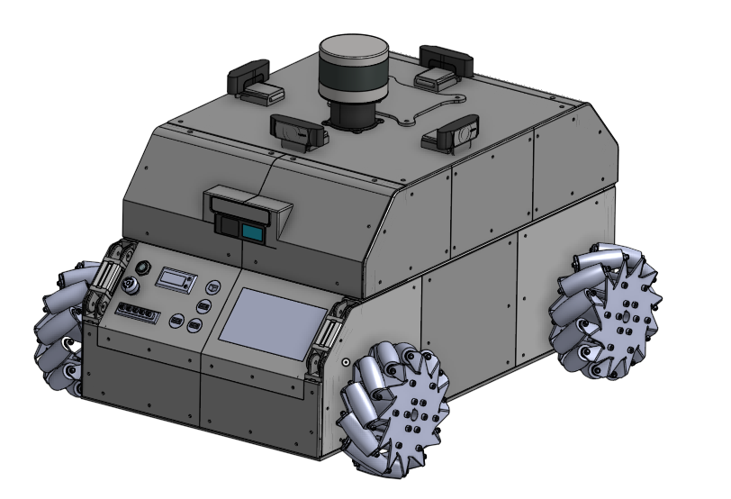
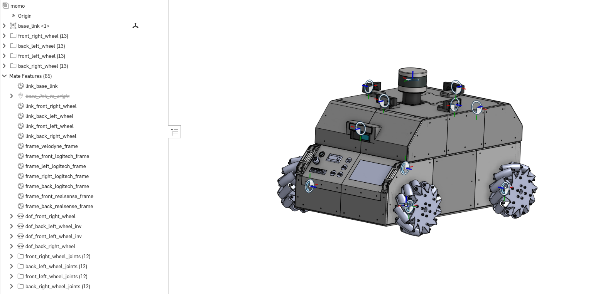
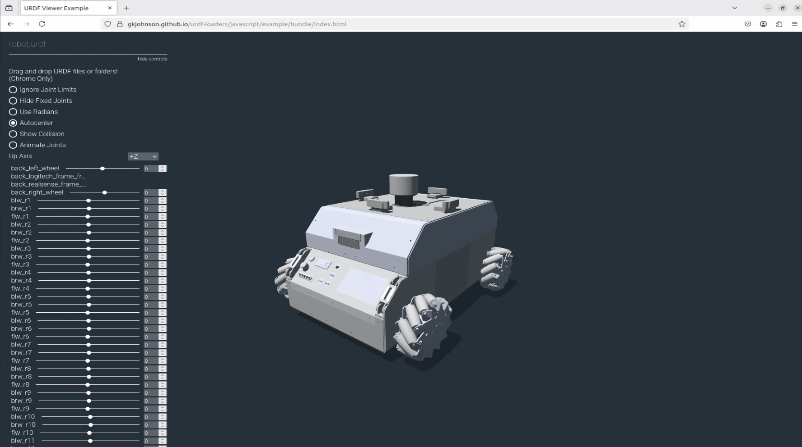
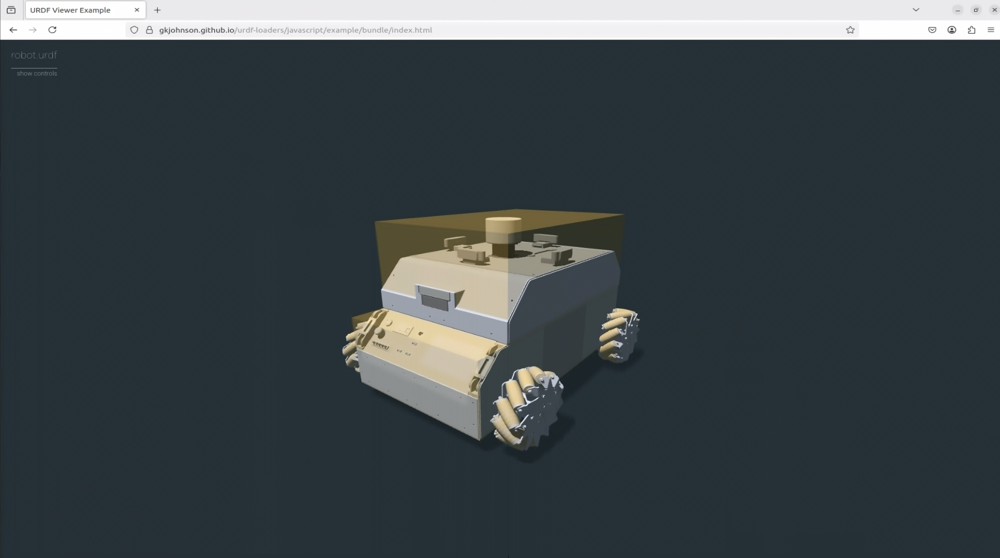
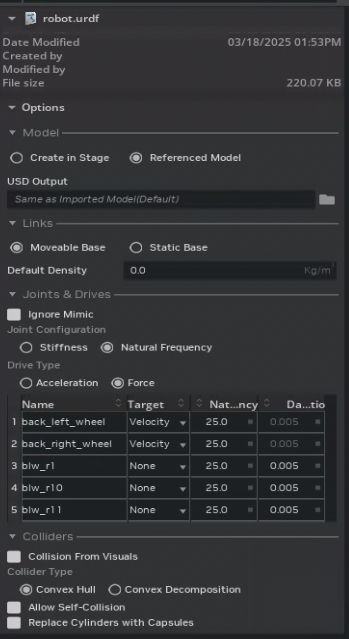
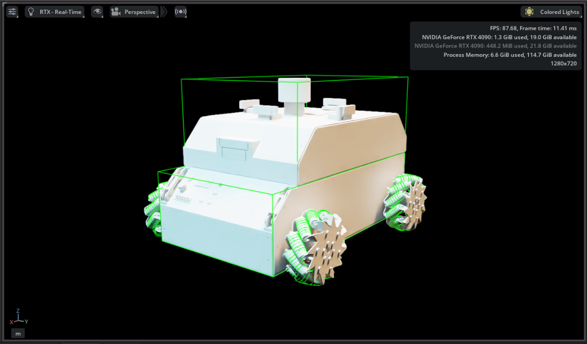
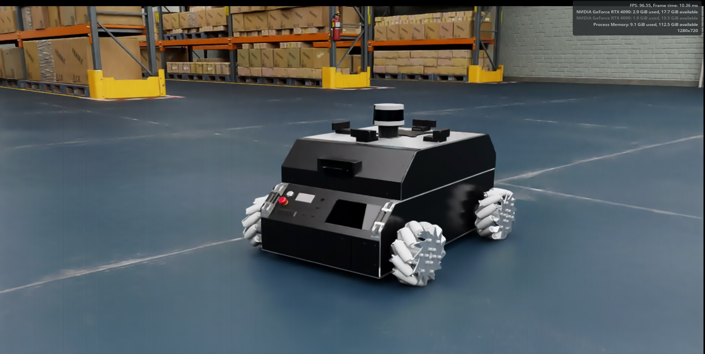
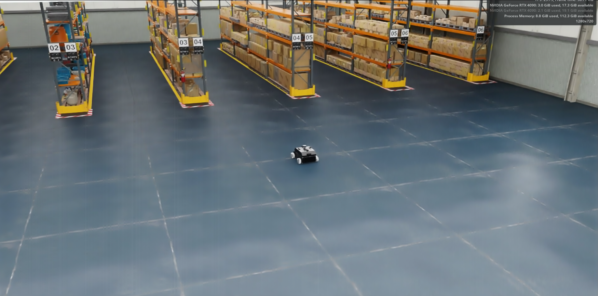
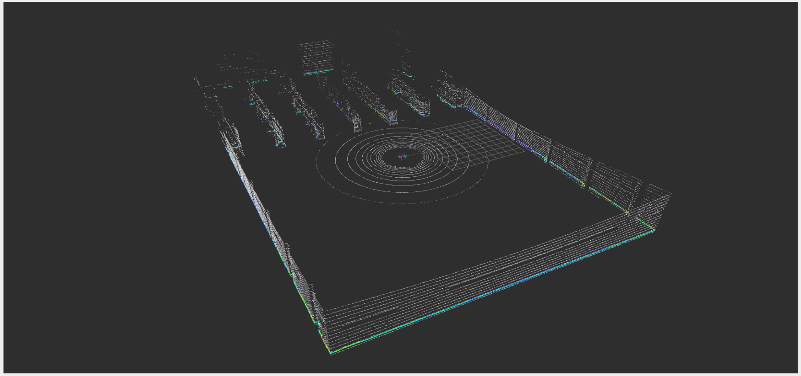

**TL;DR:** *Bringing your custom robot into NVIDIA’s Isaac Sim for realistic simulations doesn't have to be painful. In this post, I’ll walk you step-by-step using MoMo, a modular research robot*

  <strong>Note:</strong> This guide assumes you have basic familiarity with Isaac Sim. If you’re new, please first complete the 
  <a href="https://docs.isaacsim.omniverse.nvidia.com/latest/introduction/quickstart_index.html" target="_blank">official Isaac Sim getting-started tutorials</a>. 
  NVIDIA also offers excellent 
  <a href="https://www.nvidia.com/en-us/learn/learning-path/robotics/" target="_blank">courses on robotics fundamentals and Isaac Sim</a> that you might find helpful.

 

To follow along comfortably, ensure you have:

- Basic knowledge of Isaac Sim and ROS2.
- Familiarity with CAD modeling.
- Access to [Onshape](https://www.onshape.com/), a free browser-based CAD tool ideal for this workflow.
- NVIDIA Isaac Sim installed (version 4.5).

## **Why I'm Writing This Post**

When I started working alongside [Markus Knitt](https://de.linkedin.com/in/markus-knitt-a67498127) on **MoMo**, our modular mobile robot at the [Institut für Technische Logistik (ITL), TU Hamburg](https://www3.tuhh.de/itl/) , the goal was to create a versatile robot platform for diverse research experiments. The idea was simple, to allow researchers to quickly swap out top modules for various tasks like navigation, manipulation, or perception experiments.

While we made strong progress on MoMo over the last year, getting it to behave accurately in Isaac Sim was still a challenge.

## **The Struggle**

Have you ever imported your custom robot into Isaac Sim, only to witness it spectacularly fall apart? Here's MoMo falling apart in one of the early attempts:

The problem wasn’t Isaac Sim itself, but rather the lack of consolidated, clear instructions online. While information is available, it’s scattered across forums, tutorials, videos, and documentation, making it hard to know what steps to take and in which order.

After several frustrating weeks spent piecing together scattered information, it became clear that a comprehensive, step-by-step guide didn't yet exist. This guide is created specifically to save you (and future me) from experiencing those same struggles.

## **URDF Conversion**

To simulate your robot in Isaac Sim, you need a URDF (Unified Robot Description Format) file, a standardized format for robot descriptions.

I’ve been using SolidWorks for years and have become deeply familiar with its capabilities. I’ve worked with various URDF exporters like fusion2urdf for Fusion 360 and sw2urdf for SolidWorks, and I’ve always been confident in SolidWorks as my go-to tool. That said, I was genuinely impressed by Onshape, despite never considering a switch.

Specifically, Onshape's approach to mating parts using mate connectors made the URDF export straightforward, clear, and less error-prone.

## **Meet MoMo: The Modular Mobile Robot**
For this guide, I'll use MoMo as a concrete example. MoMo is open-source, modular, and features mecanum wheels ideal for omnidirectional movement. Here’s what MoMo looks like in Onshape:

<em>MoMo CAD model in Onshape</em>

You can explore MoMo’s full [documentation](https://tuhh-itl.github.io/MoMo/) and [GitHub repository](https://github.com/TUHH-ITL/MoMo) to learn more or replicate this setup yourself. It serves as an ideal example for demonstrating a realistic and practical workflow from CAD to Isaac Sim.

## **Step-by-Step: From CAD to URDF to Isaac Sim**
We’re preparing the robot model specifically for the [onshape-to-robot](https://onshape-to-robot.readthedocs.io/en/latest/) tool. This tool converts an Onshape CAD assembly into a URDF that simulation tools like Isaac Sim can understand.

Here's how to smoothly take your robot from CAD to Isaac Sim simulation:

### **1. Preparing Your Robot in Onshape**

If you're unfamiliar with Onshape assemblies, I recommend watching [this YouTube playlist](https://www.youtube.com/playlist?list=PL4FdDkwWXT9qswt3IZTyEyXQEhk2comoX).

Already assembled your robot in another CAD tool? No worries. You can import your assembled model directly into Onshape. Just zip your assembly files and import them. Onshape will load the robot as it is, but keep in mind: **mates and joints won't be preserved** during the import. 

To avoid reassembling everything from scratch:

- Group all **static (non-moving)** components using the **Group Mate**.
- Add only the **revolute** and **prismatic** mates for movable joints.

To make this work correctly, the tool expects a certain naming convention and structure in the Onshape model. Checkout the [design time considerations](https://onshape-to-robot.readthedocs.io/en/latest/design.html) for more details. The creator of onshape-to-robot provides clear instructions in [this video](https://www.youtube.com/watch?v=C8oK4uUmbRw). Although slightly outdated, it still offers valuable insights.

Follow these naming conventions for URDF compatibility:

- **Links:** `link_<link_name>`
- **Frames:** `frame_<frame_name>`
- **Joints:** `dof_<joint_name>`

Using this naming pattern ensures that the exporter recognizes and handles each part correctly when generating your URDF. If you assign materials to parts in your Onshape model, the `onshape-to-robot` tool will automatically include those material properties in the generated URDF.

After assigning your links, frames, and joints in Onshape, your model should look something like this:
 

<em>MoMo Onshape model after defining links, frames, and joints.</em>

To easily follow along, you can directly access MoMo’s fully set-up Onshape model here:👉 [MoMo Robot Onshape Model](https://cad.onshape.com/documents/0f7ba08d49760d832652e76c/w/f802382a554ac4e5d967eb06/e/176c79e9883e5c00c7190ba1)

### **2. Generating and Verifying Your URDF**

Use [onshape-to-robot](https://onshape-to-robot.readthedocs.io/en/latest/) to generate your URDF. After exporting your URDF, always verify it quickly using the [Online URDF Viewer](https://gkjohnson.github.io/urdf-loaders/javascript/example/bundle/index.html). You can drag and drop your generated folder into the viewer to visualize the URDF.

Config file to generate URDF  

<pre><code class="language-python">
# This config.json file is used to generate the URDF from Onshape
# Replace the URL with your own Onshape document URL

{
    "url": "https://cad.onshape.com/documents/0f7ba08d49760d832652e76c/w/f802382a554ac4e5d967eb06/e/176c79e9883e5c00c7190ba1",
    "output_format": "urdf",
}

# In case you want to use scad manual approximation (as explained in the video), it will be as follows:

{
    "url": "https://cad.onshape.com/documents/0f7ba08d49760d832652e76c/w/f802382a554ac4e5d967eb06/e/176c79e9883e5c00c7190ba1",
    "output_format": "urdf",
    "use_scads": true,
    "post_import_commands": [
        "cp momo_urdf/scad/*.scad momo_urdf/assets/"
    ]
}

</code></pre>

&nbsp;

Ensure:
- Correct joint rotation direction.
- Collision meshes are defined.

Here’s how your verified URDF should look, with joint sliders working correctly:
 

<em>URDF verification showing functional joint sliders</em>

Also, you can define the collision meshes in your URDF. This is important for accurate physics simulation in Isaac Sim. The online URDF viewer allows you to visualize the collision meshes.

Here’s how the collision meshes should appear in the URDF verification. Here, the collision meshes are simplified using [OpenSCAD](https://openscad.org/) manual approximation so that the simulation runs smoothly without complexity:

<em>URDF verification showing collision meshes clearly</em>

## **3. Importing the Robot into Isaac Sim**

This tutorial targets Isaac Sim **version 4.5** and is intended for wheeled mobile robots. The steps may slightly vary for other types of robots.

Steps to import:

- Open Isaac Sim and click `File → Import`.
- Choose your `.urdf` file.
- Set import settings:
    - Reference your model (recommended)
    - Choose **movable base** for mobile robots.
    - For actuated revolute joints (wheels), set **Target** to **Velocity**. Passive wheels (casters or rollers) set **Target** to **None**.
    - Keep everything else as default.

Here's the Isaac Sim import dialog box with all correct options selected:

  

<em>Isaac Sim import dialog with correct options selected</em>

After importing, a folder structure with `.usd` files appears:

- `robot_base.usd` (appearance)
- `robot_physics.usd` (physical properties)
- `robot_sensor.usd` (sensor setups)
- `robot.usd` (main model referencing others)

If the `Collision From Visuals` box is checked, collisions will be defined based on the meshes. The `robot_base.usd` in Isaac Sim appears as follows (collisions are enabled for visualization): 

<em>robot_base.usd in Isaac Sim</em>

Adjust the **articulation root** from `base_link` to the main robot prim (`/world/robot_name`). Check [Isaac Sim documentation](https://docs.isaacsim.omniverse.nvidia.com/latest/) for more details about the articulation root.

### ✅ Verifying Wheel Actuation

Before proceeding further, it’s a good idea to test if your joints and articulation are working correctly.

1. Open `robot.usd` in Isaac Sim and create a ground plane so that the robot doesn't fall through the floor.
2. In the **Stage** panel, select any of the actuated **revolute joints** (e.g., one of the wheels).
3. Set a **Target Angular Velocity**.
4. Start the simulation.

If the wheel rotates as expected, everything is working perfectly.

Repeat this for all the wheels to make sure joint configurations are correct and that your robot is able to move.

### **Customizing Appearance, Physics, and Sensors**

- Customize appearance in `robot_base.usd` ([appearance tutorial](https://www.youtube.com/watch?v=5VGCVoD4eOs)).
- Adjust friction, mass, and center-of-gravity settings in `robot_physics.usd`.
- Define sensors (cameras, lidars) in `robot_sensor.usd`. 
    - [ROS2 Cameras](https://docs.isaacsim.omniverse.nvidia.com/latest/ros2_tutorials/tutorial_ros2_camera.html)
    - [RTX Lidar Sensors](https://docs.isaacsim.omniverse.nvidia.com/latest/ros2_tutorials/tutorial_ros2_rtx_lidar.html)

 

<em>MoMo model in Isaac Sim</em>
  

## **4. Connecting to ROS 2 Using Omnigraph in Isaac Sim**

[Omnigraph](https://docs.isaacsim.omniverse.nvidia.com/latest/omnigraph/index.html), Isaac Sim’s visual scripting tool, makes integration with ROS2 straightforward. For mecanum-wheeled mobile robots like MoMo, you'll typically need:

- Omnigraph nodes for **Lidar and Camera**.
- **[ROS2 Clock](https://docs.isaacsim.omniverse.nvidia.com/latest/ros2_tutorials/tutorial_ros2_clock.html)**, **[ROS2 TF and Odometry](https://docs.isaacsim.omniverse.nvidia.com/latest/ros2_tutorials/tutorial_ros2_tf.html)** graphs.
- A **Holonomic Controller** to enable omnidirectional movement (specify wheel radius and wheel distance).

  
Omnigraph shortcuts

  
To enable communication between your simulated robot and ROS 2, Isaac Sim provides a set of Omnigraph nodes under the <strong>Robotics</strong> menu. These nodes make it easy to hook up sensors, time, and transformations with your ROS 2 system. Here’s a high-level overview of what you’ll need:

  
<strong>RTX LiDAR</strong> 
  Go to <code>Tools → Robotics → ROS2 Omnigraphs → RTX LiDAR</code> and select the LiDAR prim. Make sure the LiDAR prim (<code>Create → Sensors → RTX LiDAR → Rotating</code>) already exists in your scene. You can configure topic names, frame IDs, and other parameters directly in the Omnigraph node.

  
<strong>ROS Clock</strong> 
  Add a clock node via <code>Tools → Robotics → ROS2 Omnigraphs → Clock</code> to sync simulation time with ROS 2.

  
<strong>ROS TF Publisher</strong> 
  To publish the robot’s TF tree, use <code>Tools → Robotics → ROS2 Omnigraphs → TF Publisher</code>. Select your robot’s articulation root (e.g., <code>/World/momo</code>) as the target prim. This will include all joints in the TF tree.

  
To include sensors like LiDAR or cameras in the TF tree:

  <ul>
    <li>Open the ROS TF Omnigraph.</li>
    <li>Duplicate the <code>ROS2PublishTransformTree</code> node.</li>
    <li>Set <code>parentPrim</code> to something like <code>/World/momo/base_link</code>.</li>
    <li>Set <code>targetPrim</code> to the sensor path, e.g., <code>/World/momo/base_link/velodyne</code>.</li>
    <li>You can add more sensors by clicking <strong>+Add Target</strong> and selecting the sensor prims.</li>
  </ul>

  
<strong>Holonomic Control Setup</strong> 
  In the Holonomic control Omnigraph (check out the <code>o3dyn</code> robot model for <a href="#additional-resources">reference</a>), select the <code>USD Setup Holonomic Robot</code> node.  
  In the properties panel, set:
  <ul>
    <li><code>comPrimPath</code> to <code>/World/momo/base_link</code></li>
    <li><code>robotPrimPath</code> to <code>/World/momo</code> (the prim with the articulation root)</li>
  </ul>
  Then, select the <code>Articulation Controller</code> node and set the <code>targetPrim</code> to <code>/World/momo</code> in the property panel.

&nbsp;

**Important Note on Holonomic Controllers:**

To make the **Holonomic Controller** work properly, you must explicitly define the angles of your wheels relative to the robot frame. I found a helpful forum post that clearly explains how to set this up correctly:

→ [Setting wheel angles for holonomic robots](https://forums.developer.nvidia.com/t/usd-setup-holonomic-robot-node-not-working-for-holonomic-robot/282081)

TL;DR

Click on the actuated wheel joints in the Stage, then go to <strong>Add → Attribute</strong>

<ul>
  <li><strong>For wheel angles:</strong>
    <ul>
      <li>Name: <code>isaacmecanumwheel:angle</code></li>
      <li>Type: <code>Float</code></li>
    </ul>
  </li>
  <li><strong>For wheel radius:</strong>
    <ul>
      <li>Name: <code>isaacmecanumwheel:radius</code></li>
      <li>Type: <code>Float</code></li>
    </ul>
  </li>
</ul>

Set the wheel radius and the angles in the joint properties .The wheel radius for MoMo is <code>0.1015 m</code> and the wheel angles are:

<ul>
  <li>Front Left: -135 degrees</li>
  <li>Front Right: -45 degrees</li>
  <li>Back Left: -45 degrees</li>
  <li>Back Right: -135 degrees</li>
</ul>

&nbsp;

Ensure you follow these steps precisely, as incorrect wheel angle definitions can prevent the robot from moving as intended in simulation.

## **5. Testing Your Robot in Realistic Environments**

Here's MoMo simulated in a realistic warehouse environment within Isaac Sim, highlighting its potential for logistics or warehouse-based robotics research:
 
 

<em>MoMo in a realistic warehouse simulation environment</em>
 

## **6. Final Check in RViz**

Confirm your setup visually in RViz. Your data visualization should appear organized and correct, like this:
 
  

<em>Data visualization in RViz</em>

## **7. See your robot in action!**

Finally, here’s MoMo moving smoothly and realistically within Isaac Sim, demonstrating a successful integration.  
The velocity commands are sent from ROS 2 via the `/cmd_vel` topic.

  <video autoplay loop muted playsinline width="600">
    <source src="../assets/gifs/momo-demo.webm" type="video/mp4">
    Your browser does not support the video tag.
  </video>
  
<em>MoMo moving in Isaac Sim simulation.</em>

Congratulations! You’ve successfully brought your mobile robot from CAD into Isaac Sim for simulation. 

## **Final Thoughts**

I created this detailed yet conversational guide because I wished something like this had existed when I started working on MoMo simulation. Hopefully, this guide simplifies your robotics journey, saving you from weeks of frustration.

Have questions, comments, or experiences you’d like to share? I'd love to hear from you!

## Additional Resources 

If you are also working with **mecanum-wheeled robots**, I highly recommend checking out the **o3dyn robot model** available in Isaac Sim. It’s a great reference for omnidirectional mobile robot simulation.There's an excellent [ROSCon Talk](https://vimeo.com/879001799/0e54e12495) that dives deep into:

- Simulation modeling of highly dynamic omnidirectional mobile robots
- Design insights for accurate behavior in Isaac Sim
- Techniques to bridge the gap between simulation and real-world performance (sim2real)

They also published a [paper](https://ieeexplore.ieee.org/document/10611459) that explores how various simulation parameters affect sim2real outcomes.

For additional context, this [YouTube tutorial](https://www.youtube.com/watch?v=XEri32NaLYk) also does a great job explaining how to simulate wheeled mobile robots in Isaac Sim.

Happy simulating!

