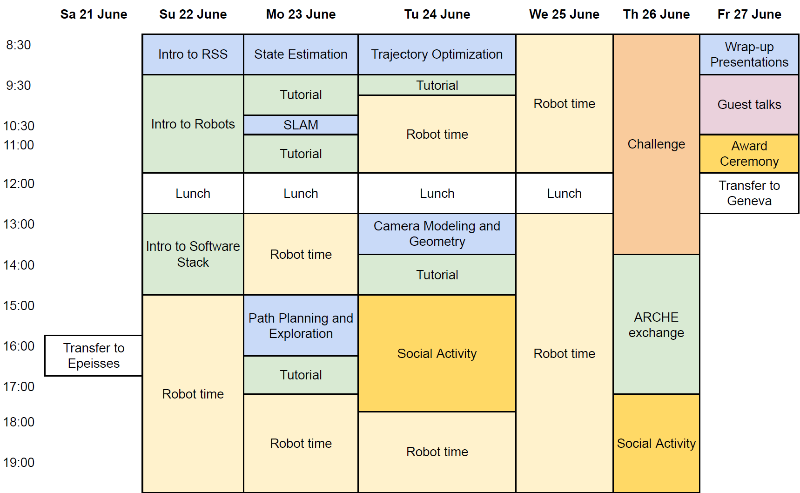
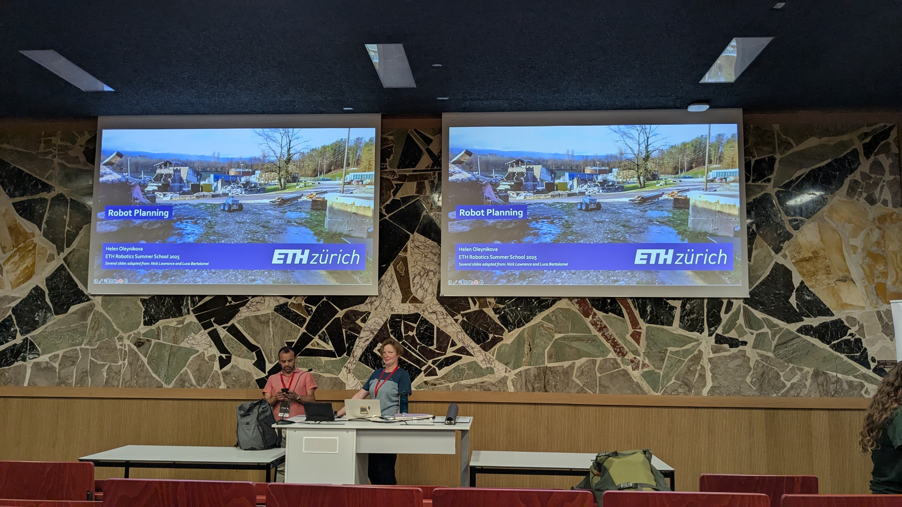
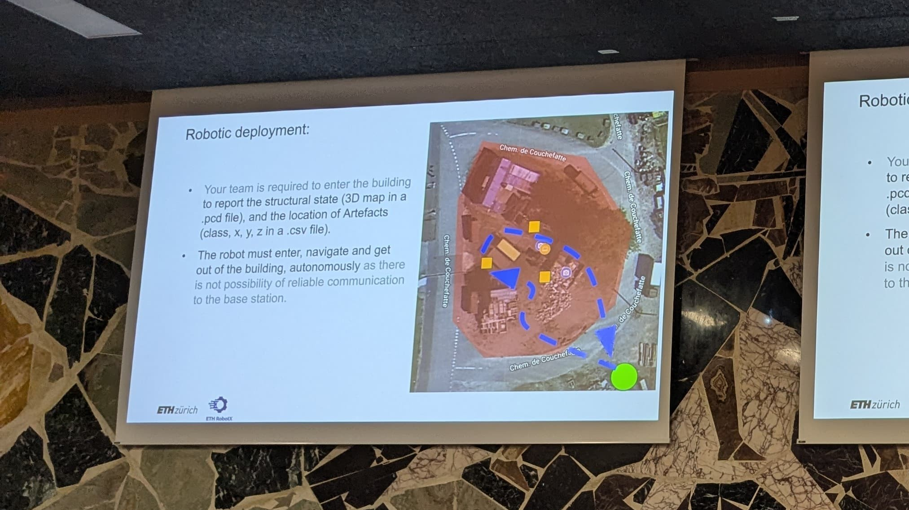

Two years ago, scrolling casually through LinkedIn, I came across a post featuring the ETH Zürich Robotics Summer School. The images of diverse robots, quadrupeds like ANYmal and Spot, drones, and autonomous wheeled robots were mesmerizing. I instantly knew this was where I wanted to be, absorbing knowledge directly from some of the best roboticists in the world.

Fast-forward to June 2025, I finally found myself at ETH Zürich's prestigious Robotics Summer School, experiencing firsthand what I'd only imagined for years. In this blog, I'll share my experience and insights gained during one of the most enriching weeks of my academic life.


../assets/images/blog/eth/group_photo.jpg
../assets/images/blog/eth/intro.jpeg
../assets/images/blog/eth/social_activity.JPG
../assets/images/blog/eth/lecture.jpeg
../assets/images/blog/eth/epeisses.jpeg



## **An Intensive Week in Robotics**

From June 21–27, the schedule was packed with insightful lectures, hands-on tutorials, real-world robotic demonstrations, and collaborative projects. Every day brought new excitement, challenges, and inspiring discussions.

The program focused heavily on core robotics fundamentals:

- **Lectures & Tutorials:**
    - State estimation
    - Simultaneous Localization and Mapping (SLAM)
    - Path planning and exploration
    - Trajectory optimization
    - Camera modeling and geometry
- **Hands-on Experiences:**
    - Working directly with robotic platforms, the SuperMegaBot robots.
    - Implementing learned concepts in a competitive search and rescue challenge.
- **Special Events:**
    - Spectacular robotic demonstrations, quadrupeds exploring rough terrains, and drones gracefully maneuvering above water.
    - ARCHE exchange, showcasing cutting-edge robotics research projects.
    - Networking sessions, insightful guest talks, and social activities.

One of the highlights for me was attending lectures delivered by prominent researchers affiliated with Google DeepMind, NVIDIA, Microsoft Research, and ETH Zürich. Sitting in a room filled with passionate roboticists, some of whom I'd previously known only through research papers or YouTube videos, was surreal. Every talk was an intellectual feast, deepening my understanding of the latest breakthroughs and challenges in robotics.

<!--  -->

Witnessing robot demonstrations further amplified my excitement. From surface drones and quadrupeds effortlessly navigating challenging terrains to impressive humanoid robots mimicking human-like movements, every demo felt straight out of science fiction.

Our main practical task was the Search and Rescue Robotics Challenge. Divided into eight teams of six members each, we used SuperMegaBot robots to autonomously explore and localize specific artifacts in unknown environments. I got an opportunity to work on the object detection and localization pipeline. My team consisted of Masters and PhD students, each bringing unique expertise.

Collaborating in such a diverse and talented team profoundly impacted my learning curve. Through teamwork, we managed to create a robust system, enhancing both my technical skills and my ability to collaborate effectively.

Perhaps the most valuable transformation was in my approach to robotics itself. Before attending this summer school, I primarily considered myself a robotics engineer, someone capable of making robotic systems work. After a week surrounded by visionary roboticists, I realized the importance of truly understanding **why** systems work the way they do.

I started asking more fundamental questions about the underlying math and algorithms rather than just focusing on implementation. This shift from thinking as an engineer to a roboticist opened up a whole new perspective, deepening my interest in foundational concepts.

An unexpected yet vital lesson I learned is that while you can have broad knowledge in robotics, true impact often comes from deep specialization. Robotics, as I discovered, is inherently collaborative; it’s a field that thrives on diverse expertise coming together to solve challenging problems.

I had the opportunity to meet fellow participants from world-renowned institutions such as ETH Zürich, Stanford, UPenn, Carnegie Mellon, TUM, and EPFL, each bringing unique perspectives and experiences to the program. Everyone I met was incredibly supportive, humble, and passionate. Our daily discussions revolved around topics such as robotics, reinforcement learning, large language models, and current research challenges. I made connections with passionate people from around the world - Switzerland, Germany, Iran, Italy, Japan, China, and many more, each conversation expanding my horizon even further.

Social activities added a memorable layer to our experience. Each morning kicked off with sports like running, yoga, and even karate. Group dance sessions, adventure games, and an end-of-week barbecue further strengthened our bonds. Exchanging LinkedIn details on the final day felt bittersweet, we’d forged incredible connections and were hopeful about staying in touch.


../assets/images/blog/eth/presentation.jpg
../assets/images/blog/eth/team_photo.jpeg



Leaving the summer school, my passion for robotics felt renewed and refocused. I learned the importance of thinking from first principles. The week reinforced why I fell in love with robotics in the first place: the infinite possibilities and the chance to push boundaries alongside brilliant, passionate peers.

Now, more than ever, I’m committed to strengthening my fundamentals, deepening my specialization, and embracing collaborative projects. This summer school experience has undeniably reshaped my career aspirations, making me realize we're at the beginning of a genuine robotics revolution, and I want to be part of it.

I’m incredibly grateful to ETH Zürich and the Robotics Systems Lab for organizing such a phenomenal summer school. Experiencing world-class research and collaboration firsthand is something I’ll cherish forever.

If you're passionate about robotics, my advice is simple: seize opportunities like this. The experience might just transform how you see yourself, your career, and the future of robotics itself.

Thanks for reading! If you have any questions or thoughts about the summer school or robotics in general, feel free to reach out!.

Happy learning!

- **Resources:**
  - [Lecture slides and Tutorials](https://ethz-robotx.github.io/RoboticsSummerSchool/rss/)
  - [Robotics Summer School Official Page](https://robotx.ethz.ch/education/summer-school.html)
