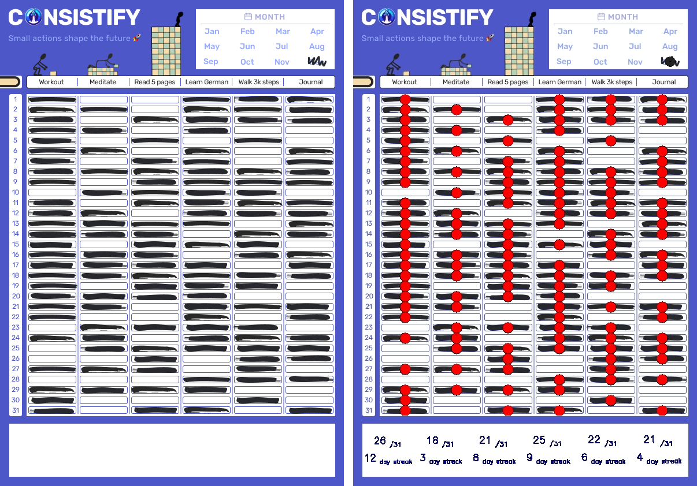
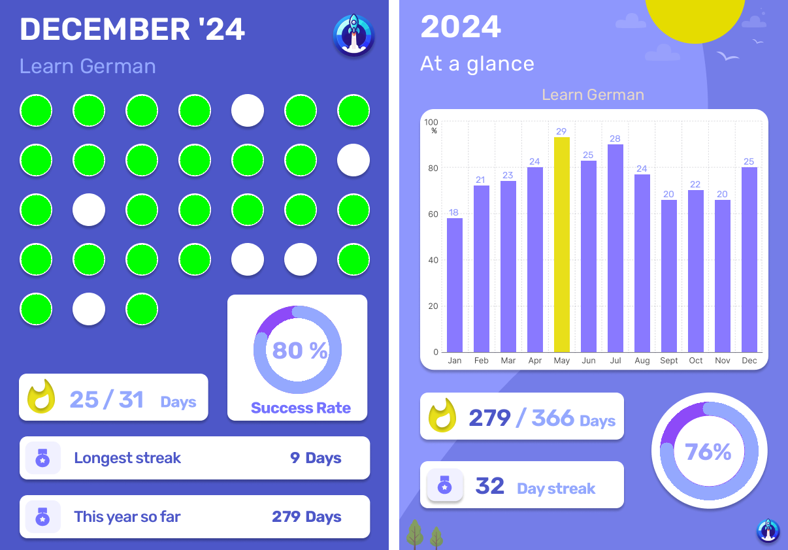

## Consistify - Streamlined Habit Tracking and Analysis

**Consistify** is a habit-tracking application designed to simplify the process of monitoring and analyzing your daily routines. Unlike traditional habit trackers that require daily data input, Consistify allows you to mark your habits on a physical template and upload a photo at the end of the month. The app then extracts the data and provides comprehensive insights into your habit performance.

**Live Application**: [consistify.streamlit.app](https://consistify.streamlit.app)



### Key Features

- **Simplified Data Entry**: Eliminates the need for daily digital entries by allowing monthly uploads of habit tracking templates.

- **Automated Data Extraction**: Utilizes image processing techniques to extract habit data from uploaded photos.

- **Comprehensive Insights**: Generates detailed monthly and yearly reports, including metrics such as the number of days a habit was performed, longest streak, and success rate.

- **User-Friendly Design**: Features an engaging interface, with templates and reports.

- **Secure Data Storage**: Employs Firebase for secure data storage, ensuring user information is protected.

- **User Authentication**: Includes login functionality, enabling multiple users to securely store and access their habit data.

  
  
<em> Image processing and Data extraction</em>

  
  
<em> Yearly and Monthly insights</em>

### Development Journey

The development of Consistify involved several key steps:

1. **Conceptualization**: Identified the need for a less intrusive habit-tracking method that reduces daily digital interactions.

2. **Design**: Learned Figma and basic UI design principles to create engaging templates and user interfaces.

3. **Image Processing**: Developed Python scripts utilizing OpenCV to extract data from uploaded habit tracking template images.

4. **Data Analysis**: Implemented scripts to analyze extracted data and generate insightful metrics and visual reports.

5. **Application Development**: Built the application using Streamlit for the front end and integrated Firebase for backend data storage and user authentication.

6. **Deployment**: Deployed the application, making it accessible to users at [consistify.streamlit.app](https://consistify.streamlit.app).

### Technologies Used

- **Programming Languages**: Python

- **Libraries and Frameworks**: OpenCV, Streamlit

- **Design Tools**: Figma

- **Backend Services**: Firebase (for data storage and user authentication)

### Future Plans

Consistify is a project close to my heart, and I plan to continue its development based on user feedback. Future enhancements may include:

- **Enhanced Image Recognition**: Improving the accuracy of data extraction from uploaded images.

- **Customizable Templates**: Allowing users to create and use personalized habit tracking templates.

- **Additional Metrics**: Introducing more detailed analytics to provide deeper insights into habit formation and consistency.

For more details and access to the source code, visit the GitHub repository: [github.com/manavthakkar/consistify](https://github.com/manavthakkar/consistify)

*All resources and tools used in the development of Consistify are listed in the GitHub repository.*

